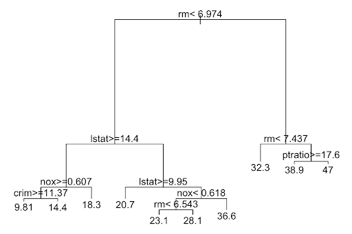
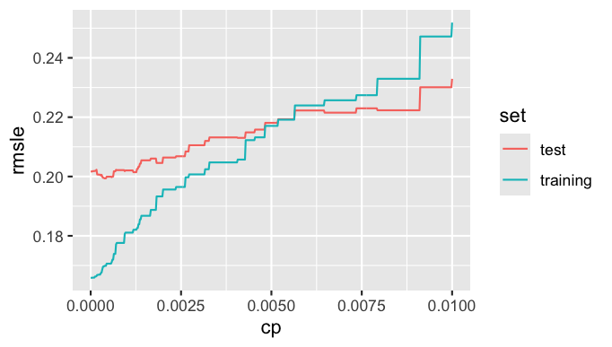

<p align="center">

</p>

# CART ML Model

> This machine learning model utilizes Classification and Regression Trees (CART) to estimate house prices by analyzing several predictors, with RMSLE assessing the model’s precision.

<a name="toc"/></a>
## Table of Contents

1. [Overview](#overview)

2. [Technologies](#technologies)

3. [Fit Model / Predict](#fit)

4. [Complexity Parameter](#cp)

5. [10-Fold Cross Validation](#cross)

6. [Source](#source)

<a name="overview"/></a>
## 1. Overview
[Back to ToC](#toc)

In a CART model, the tree is constructed by splitting the data into branches that minimize the variance of the target variable within each branch, with the final output being a predicted numerical value. The complexity parameter (cp), a type of hyperparameter, influences the model’s complexity, where a smaller cp indicates a more complex model.



By fitting models across a range of cp values, we can observe how the complexity parameter affects the RMSLE. Typically, a smaller cp leads to overfitting, resulting in a lower RMSLE on the training data but a higher RMSLE on the test data. The goal of this project is to find the optimal cp that minimizes RMSLE while avoiding overfitting.

<a name="technologies"/></a>
## 2. Technologies
[Back to ToC](#toc)

RStudio Version 2024.04.1+748 (2024.04.1+748)

<a name="fit"/></a>
## 3. Fit Model / Predict
[Back to ToC](#toc)

We fitted the model on 8 predictor variables selected with a complexity parameter of 0 using the following function on the training data.

```bash
model_CART <- rpart(SalePrice ~ GrLivArea + YearBuilt + BedroomAbvGr + SaleCondition + KitchenQual + MSSubClassClean + HalfBath + LotArea, data = training, cp = 0)
```

We calculated the RMSLE for the training data and compared it to the RMSLE provided by Kaggle. As anticipated, the RMSLE for the training data was significantly lower than that for the test data due to overfitting. The model performed well on the training data but struggled to predict accurately on data that differed from the training set.

After fitting the model, we predicted the sale prices for test data that only included the predictor variables.

```bash
# predict sales price on test using fitted/trained model
test$SalePrice <- predict(model_CART, newdata = test)
```

<a name="cp"/></a>
## 4. Complexity Parameter
[Back to ToC](#toc)

We graphed the RMSLE for a range of cp values from 0 to 0.01 to find the optimal cp. 



After plotting the RMSLE across a range of cp values, we identified 0.0003808 as the cp with the lowest RMSLE. We then fitted a CART model using this cp value, but the RMSLE returned by Kaggle was higher than the RMSLE when cp was set to 0.

<a name="cross"/></a>
## 5. 10-Fold Cross Validation
[Back to ToC](#toc)

My final goal was to improve the accuracy of the Kaggle score estimates using cross-validation. I accomplished this by performing 10-fold cross-validation. The data was randomly split into 10 folds, with 9 folds used for training (train_validation) and the remaining fold for testing (test_validation). This process was repeated, with each fold taking a turn as the test set. For each fold, I fitted the model on the train_validation data and predicted sales prices on the test_validation data. Finally, I averaged the 10 RMSLE scores to estimate the Kaggle score for cp = 0. The resulting RMSLE score was lower than the original estimate.

<a name="source"/></a>
## 6. Source
[Back to ToC](#source)

The data and test RMSLE was retrieved from Kaggle's [House Prices: Advanced Regression Techniques](https://www.kaggle.com/c/house-prices-advanced-regression-techniques/) competition.
