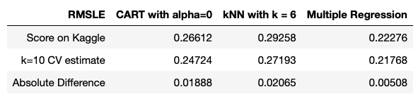
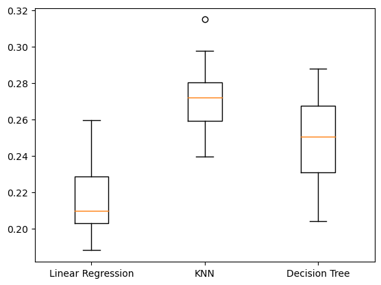

# Cross Validation

> Assess the accuracy of 10-fold cross-validation estimates in predicting Kaggle scores using K-Nearest Neighbors, multiple regression, and CART models.

## Table of Contents

1. [Overview](#overview)

2. [Technologies](#technologies)

3. [Final Output](#output)

5. [Source](#source)

## 1. Overview
[Back to ToC](#toc)

In a K-nearest neighbors model, the prediction for a new data point is made by considering the outcomes of the 'k' closest data points in the training set. 

I can improve the accuracy of the Kaggle score estimates by performing 10-fold cross-validation. The data was randomly split into 10 folds, with 9 folds used for training (train_validation) and the remaining fold for testing (test_validation). This process was repeated, with each fold taking a turn as the test set. For each fold, I fitted the model on the train_validation data and predicted sales prices on the test_validation data. Finally, I averaged the 10 RMSLE scores to estimate the Kaggle score.

For each of the 3 models, we submit the test data on Kaggle to retrieve an RMSLE score, perform 10-fold cross validation, and find the absolute difference to identify the model that most accurately estimates the true RMSLE score. 

## 2. Technologies
[Back to ToC](#toc)

Jupyter Notebook
Python 3.11.4 (main, Jul 5 2023, 09:00:44) [Clang 14.0.6]

## 3. Final Output
[Back to ToC](#toc)

I compiled the Kaggle RMSLE score and 10-fold cross validation RMSLE score into a table and found the absolute difference. Based on the results, k = 10 cross validation most accurately estimates the Kaggle score using a multiple regression model. 

## 4. Source
[Back to ToC](#toc)

The data and test RMSLE was retrieved from Kaggle's [House Prices: Advanced Regression Techniques](https://www.kaggle.com/c/house-prices-advanced-regression-techniques/) competition.
