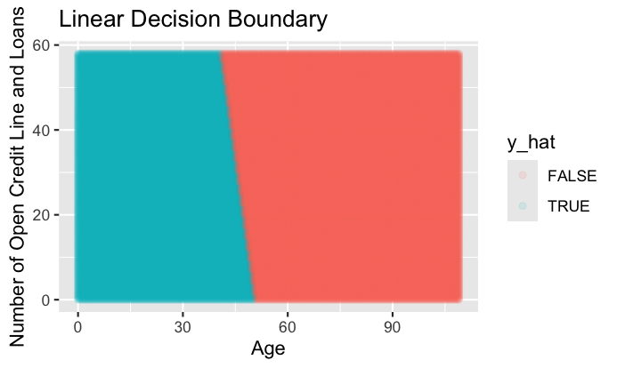

# Logistic Regression ML Model

> A machine learning model that employs logistic regression to predict who will experience financial distress in the next two years as a function of age and the number of open credit lines and loans, with RMSLE used to assess the model's accuracy.

<a name="toc"/></a>
## Table of Contents

1. [Overview](#overview)

2. [Technologies](#technologies)

3. [Exploratory Data Analysis](#analysis)

4. [Fit Model / Predict](#fit)

5. [Area Under the Curve](#auc)

6. [Cross Validation](#cross)

7. [Linear Decision Boundary](#boundary)

8. [Source](#source)

<a name="overview"/></a>
## 1. Overview
[Back to ToC](#toc)

The logistic regression machine learning model is used for binary classification tasks that predicts one of two outcomes (e.g., "yes" or "no," "0" or "1"). In this case, the possible outcomes are either "1," the person will experience financial distress in the next two years or "0," the person will not experience financial distress in the next two years (serious_dlqin2yrs), both as a function of age and the number of open credit lines and loans (number_of_open_credit_lines_and_loans).<br />

Logistic regression uses the sigmoid function to map predicted values to probabilities between 0 and 1.<br />

After calculating the probability, logistic regression applies a threshold (usually 0.5) to classify the input into one of the two classes. For example, if the probability is greater than 0.5, the model might classify the input as class 1; otherwise, it classifies it as class 0.<br />

The area under the curve (AUC) measures the performance of a logistic regression model by calculating the area under the ROC curve. The ROC curve plots the true positive rate against the false positive rate. The AUC ranges from 0 to 1. AUC = 0.5 is equivalent to random guessing and AUC = 1 indicates a model that can perfectly distinguish between the 2 classes.

<a name="technologies"/></a>
## 2. Technologies
[Back to ToC](#toc)

RStudio Version 2024.04.1+748 (2024.04.1+748)

<a name="analysis"/></a>
## 3. Exploratory Data Analysis
[Back to ToC](#toc)

I conducted exploratory data analysis and found the following conclusions:<br />
1. If I guessed serious_dlqin2yrs is TRUE for all observations, I would expect to be right for 10026 observations, or 6.68% of the time.
2. serious_dlqin2yrs has a negative relationship with age.
3. serious_dlqin2yrs has a negative relationship with number_of_open_credit_lines_and_loans.

<a name="fit"/></a>
## 4. Fit Model / Predict
[Back to ToC](#toc)

I fitted the logistic regression model on age and number_of_open_credit_lines_and_loans using the following function on the training data.

```bash
model_logistic <- glm(serious_dlqin2yrs ~ age + number_of_open_credit_lines_and_loans, data = training, family = "binomial")
```

After fitting the model, I predicted the probability of experiencing financial distress in the next 2 years for test data that only included the predictor variables.

```bash
test$y_prob <- predict(model_logistic, newdata = test, type = "response")
```

<a name="auc"/></a>
## 5. Area Under the Curve
[Back to ToC](#toc)

I calculated the AUC by predicting the model on the training data, which returns an estimate of the AUC score returned by Kaggle. The result was 0.636.

```bash
training$y_hat <- predict(model_logistic, newdata = training, type = "response")

auc <- auc(roc(training$serious_dlqin2yrs, training$y_hat))
print(auc)
```

<a name="cross"/></a>
## 6. Cross Validation
[Back to ToC](#toc)

Although I got an estimate of the Kaggle score by predicting the model on the training data, I can perform k = 5 fold cross validation to improve the accuracy of the estimate. 

The data was randomly split into 5 folds, with 4 folds used for training (train_validation) and the remaining fold for testing (test_validation). This process was repeated, with each fold taking a turn as the test set. For each fold, I fitted the model on the train_validation data and predicted sales prices on the test_validation data. Finally, I averaged the 5 AUC scores to estimate the Kaggle score. The resulting RMSLE score was closer to the Kaggle score than the previous estimate.

<a name="boundary"/></a>
## 7. Linear Decision Boundary
[Back to ToC](#toc)

Below, I illustrate a linear decision boundary that sets the boundary at which the predicted level of a binary variable switches from blue to red when I use a model with two numerical predictors age on the x-axis and number_of_open_credit_lines_and_loans on the y-axis. I set the decision boundary to 0.0668, which was the probability that I would expect to be right if I guessed serious_dlqin2yrs as TRUE for all observations. 



<a name="source"/></a>
## 8. Source
[Back to ToC](#toc)

The data and AUC score was retrieved from Kaggle's [Give Me Some Credit](https://www.kaggle.com/c/GiveMeSomeCredit) competition.
