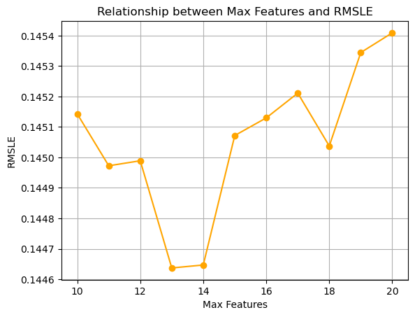

<p align="center">

</p>

# Random Forests ML Model

> A random forests machine learning algorithm is used here to predict house prices based on a diverse set of predictors, with RMSLE ensuring model accuracy.

<a name="toc"/></a>
## Table of Contents

1. [Overview](#overview)

2. [Technologies](#technologies)

3. [Fit Model / Predict](#fit)

4. [Optimal Hyperparameter](#optimal)

5. [Source](#source)

<a name="overview"/></a>
## 1. Overview
[Back to ToC](#toc)

A Random Forest combines the predictions of multiple models (in this case, decision trees) to produce a final prediction that is typically more accurate and robust than that of any single decision tree.<br />

In a Random Forest, each tree is trained on a random subset of the data and a random subset of features.<br />

Random Forest uses a technique called bagging, where multiple subsets of the original dataset are created by random sampling with replacement. Each decision tree is trained on one of these subsets, which helps to decrease the variance of the model. This is represented as the n_estimators parameter, which is the number of bootstrap resamping with replacement CART model versions of the original training data.<br />

When constructing each tree, Random Forest only considers a random subset of features for splitting at each node. This reduces correlation among the trees and improves the model’s ability to capture diverse patterns in the data. This is represented as the max_features parameter, which is a complexity hyperparameter that a CART tree randomly samples 6 features from the 36 total features to split on at each internal node. 

<a name="technologies"/></a>
## 2. Technologies
[Back to ToC](#toc)

Jupyter Notebook<br />
Python 3.11.4 (main, Jul 5 2023, 09:00:44) [Clang 14.0.6]

<a name="fit"/></a>
## 3. Fit Model / Predict
[Back to ToC](#toc)

After scaling the outcome variable to (log + 1) space to avoid negative fitted values, I fitted the random forest model to randomly sample 6 of the 36 features at each internal node and use 1000 CART models using the following function on the training data.

```bash
rf_model = RandomForestRegressor(n_estimators = 1000, bootstrap = True, max_features = 6)
rf_model.fit(X_train, np.log1p(y_train))
```

I converted the outcome variable back to the original units and predicted the training model on the test data. 

```bash
submission['SalePrice'] = np.expm1(rf_model.predict(X_test))
```

<a name="optimal"/></a>
## 4. Optimal Hyperparameter
[Back to ToC](#toc)

I used GridSearchCV to identify the optimal number of features to randomly sample at each internal node (max_features), which is the one that returns the lowest estimate of the Kaggle score. The optimal hyperparameter was 13 features, which returned an estimate of 0.14464.<br /> 

Below is a line plot comparing the RMSLE based on the number of features. It is clear that the RMSLE for 13 features is the minimum. The resulting Kaggle score with 13 features was lower than for 6 features. 



<a name="source"/></a>
## 5. Source
[Back to ToC](#toc)

The data and RMSLE score was retrieved from Kaggle's [Give Me Some Credit](https://www.kaggle.com/c/GiveMeSomeCredit) competition.
